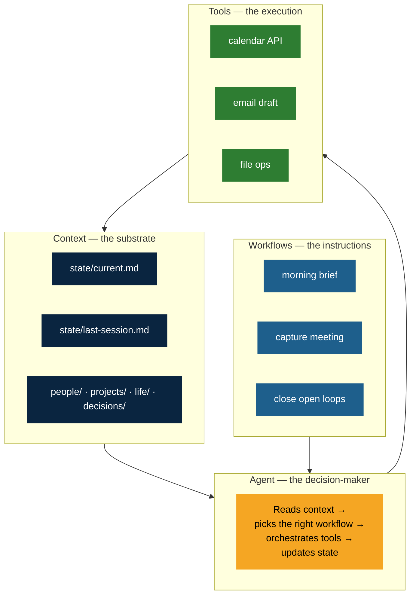
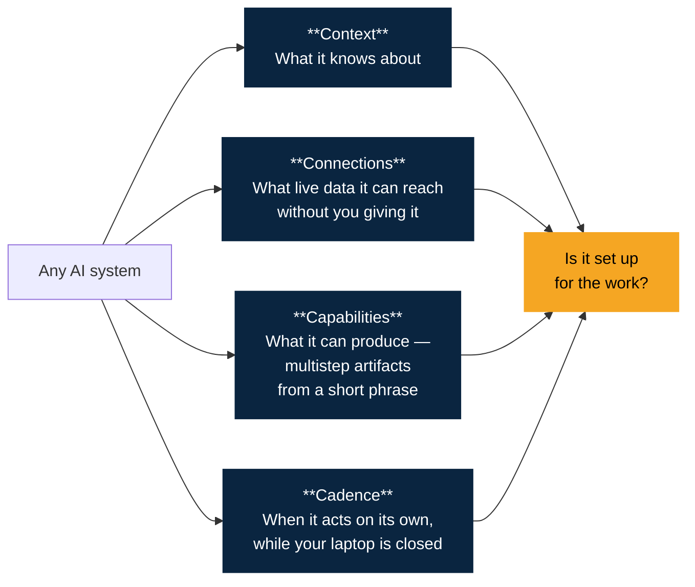

<div align="center">

# CoS Kit

### A Chief of Staff for Claude Code

*The full picture — work, health, family — in one place.*

[](LICENSE)
[](https://docs.claude.com/en/docs/claude-code)
[](https://azuldigital.ai)
[](CONTRIBUTING.md)

[**Quick start**](#quick-start) · [**What you get**](#what-you-get) · [**WATC architecture**](#the-watc-architecture) · [**The 4Cs**](#the-4cs-lens) · [**FAQ**](#faq) · [**Docs**](docs/)

</div>

---

> *"This is not an AI assistant in the chatbot sense. It's a Chief of Staff that holds the full picture across your work, your health, and your family commitments. It briefs me before meetings, captures conversations after, closes open loops, and flags what's drifting before I notice."*
>
> — **Steven Christopher**, founder, Azul Digital

Steven has been running a version of this on Claude Code for months. It changed how he runs his work, his health, and his family. He wanted to give the foundation away.

This is that foundation, minus the Azul-specific integrations. Anyone with Claude Code can stand it up in about 30 minutes.

---

## What you get

```
cos-kit/
├── CLAUDE.md          The WATC foundation — Workflows, Agents, Tools, Context.
│                      Useful across any Claude Code project, not just CoS.
├── Build-CoS.md       A self-executing setup script. Claude reads it,
│                      interviews you for ~20 minutes, then writes your
│                      custom Chief of Staff.
├── docs/
│   ├── watc.md        The architecture in detail.
│   ├── 4cs.md         The lens we use to evaluate every agent decision.
│   ├── why-not-an-assistant.md
│   └── after-setup.md First moves after the kit finishes building.
├── LICENSE            MIT.
└── CONTRIBUTING.md    What we want PRs on, what we don't.
```

Personal and health goals compete on equal terms with work. A missed workout streak or a dropped family commitment surfaces with the same weight as a client deliverable. That is the point.

---

## Quick start

You need [Claude Code](https://docs.claude.com/en/docs/claude-code) installed and an empty folder.

```bash
# 1. Clone (or just download CLAUDE.md and Build-CoS.md)
git clone https://github.com/Azul-Digital-Partners/cos-kit my-chief-of-staff
cd my-chief-of-staff

# 2. Open Claude Code in this folder
claude
```

Then tell Claude:

> Read `CLAUDE.md` first, then follow `Build-CoS.md` to set up my Chief of Staff.

It will preserve the foundation rules, then walk you through nine short interview sections — about you, your work, your goals, your people, your family, your health, and how you like to be talked to.

About 20–30 minutes total. At the end you have a working Chief of Staff customized to you, named whatever you want it named.

---

## The WATC architecture

WATC separates the four things an AI system has to do well: hold **Context** the agent can read at session start, follow **Workflows** that name how work gets done, route through an **Agent** that makes the judgment calls, and run **Tools** that execute deterministically.



**Why this works:** if every step is 90% accurate, you're at 59% after five steps. Moving execution to scripts (where accuracy is 100%) stops that decay. Persistent state files let the next session start with the last session's output, instead of cold.

Read more: [`docs/watc.md`](docs/watc.md).

---

## The 4Cs of AI development

Four axes for evaluating any AI system. We use them on every agent we ship.



| C | What it means | Common failure | The fix |
|---|---|---|---|
| **Context** | What the AI knows about | Asks "what's going on?" every session | Better state files |
| **Connections** | What live data it can reach without you giving it | Asks you to summarize your own inbox | Wire the integration |
| **Capabilities** | What multistep artifacts it can produce from a short phrase | Same workflow rebuilt from scratch every time | Name it, write the skill |
| **Cadence** | When it acts on its own, while your laptop is closed | Only useful when you remember to use it | Cron, webhook, or scheduled trigger |

Read more: [`docs/4cs.md`](docs/4cs.md).

---

## A session in practice

**An AI assistant:**

> **You:** Anything I should know before the 10am with Casey?
>
> **Assistant:** I don't have access to your calendar or previous meeting notes. Could you share what you'd like to discuss?

**Your Chief of Staff:**

> **You:** Anything I should know before the 10am with Casey?
>
> **CoS:** Three things. (1) You committed last week to a revised statement of work by end of this week — draft is still open in `decisions/commitments.md`. (2) Casey raised pricing concerns on the May 14 call; you said you'd come back with an option B. (3) She's been promoted since you last spoke — congratulating her would be a nice open.

Same model running underneath. The difference is what you put around it.

---

## What this kit does **not** ship

This is the give-away foundation, not the full Azul stack. Out of scope on purpose:

- Multi-agent orchestration (engineering, marketing, finance agents working as a team)
- Pre-wired integrations (Notion, HubSpot, Outlook, Slack, QuickBooks)
- Hosted version, web UI, or mobile app
- Client/CRM tracking, billing, or any kind of revenue pipeline

You get the architecture, the methodology, and a working personal Chief of Staff. Everything else, you grow yourself — or [bring us in](#from-azul-digital) to wire it.

---

## FAQ

<details>
<summary><strong>Do I need to be technical to use this?</strong></summary>

You need to be able to install [Claude Code](https://docs.claude.com/en/docs/claude-code), open a terminal, and drop two files in a folder. That's it. The setup script does the rest by interview.
</details>

<details>
<summary><strong>Where does my data live?</strong></summary>

Entirely on your machine, in the folder you set up. Nothing leaves your laptop unless you wire integrations later (and those are your calls, not ours).
</details>

<details>
<summary><strong>Why is the foundation generic and not Chief-of-Staff-specific?</strong></summary>

Because the WATC architecture in `CLAUDE.md` is useful across *any* Claude Code project. The setup script preserves it as the base layer and writes a CoS-specific layer on top. If you later spin up an engineering agent, a marketing agent, or a research agent in another folder, the same foundation applies.
</details>

<details>
<summary><strong>Can I rename it?</strong></summary>

Your local Chief of Staff can be named anything you like — the setup script asks. Forks of this repo can be branded anything you like too. The upstream repo stays Azul Digital branded (see [`CONTRIBUTING.md`](CONTRIBUTING.md)).
</details>

<details>
<summary><strong>How is this different from ChatGPT memory or Claude Projects?</strong></summary>

Both of those store context. Neither runs deterministic tools, follows workflow SOPs, or updates persistent state files you can read, edit, and version-control. This kit is an *operating system*, not a memory layer.
</details>

<details>
<summary><strong>What if I want integrations?</strong></summary>

Two paths. (1) Build them yourself — the kit teaches the pattern, and Claude Code is good at this. (2) [Book a call with Azul Digital](https://azuldigital.ai/contact) — wiring integrations into a Chief of Staff is exactly what we do for clients.
</details>

<details>
<summary><strong>Will you accept PRs?</strong></summary>

Bug reports, doc fixes, better diagrams, workflow examples — yes please. Feature creep, pre-wired integrations, renamed branding — no. See [`CONTRIBUTING.md`](CONTRIBUTING.md).
</details>

---

## From Azul Digital

This kit is the foundation of a much larger system we run at [Azul Digital](https://azuldigital.ai) — a full digital workforce of specialized agents (engineering, marketing, finance, customer success), all coordinated through the same WATC architecture and the 4Cs lens.

If you want to see how the methodology scales beyond a personal CoS — or you want help wiring integrations into your Chief of Staff — **[book a call](https://azuldigital.ai/contact)**.

The kit is complete on its own. The call is for when you want to go further.

---

## Contributing

We actively want bug reports, doc clarifications, workflow examples, and better Mermaid diagrams. We don't want feature creep, pre-wired integrations, or rebranding PRs on the upstream. Full details in [`CONTRIBUTING.md`](CONTRIBUTING.md).

## License

[MIT](LICENSE). Use it, fork it, ship it, sell what you build on top of it.

## Credits

Built by **Steven Christopher** and the team at **[Azul Digital](https://azuldigital.ai)**.

If this helps you, we'd love to hear about it. Open an issue, tag `#azul-cos-kit` somewhere public, or just send a note.
